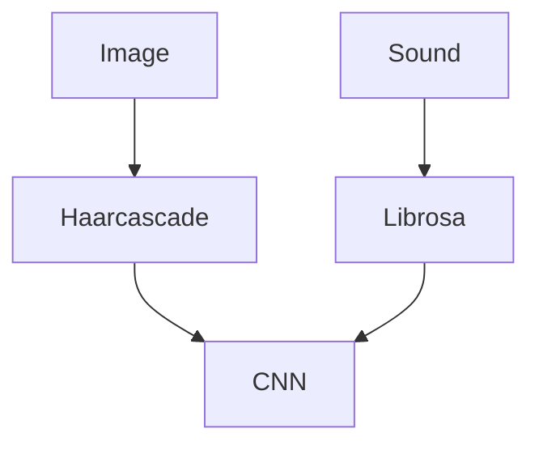

# TEMAN DISABILITAS

## Description

This project are build to help people with hearing disability. The idea is to give help by providing real time translation based on mouth movement and it's sound.

## How it's Work



Haarcascade and librosa here are used for preprocessing. Haarcascade is used to detect mouth from face image. On the other hand,  librosa is used to extract acoustic features, such as Mel-frequency cepstral coefficients (MFCCs), from audio waveforms.
> Note: The model trained still limited for vowel. And the model for image and voice recognition are separated.

## How to Install and Run the Project

### 1. Clone Project
```
git clone https://github.com/dipp-12/teman-disabilitas
cd teman-disabilitas
```

### 2. Install virtual environment (optional)
Virtual environment used to create isolated Python environments for their own installation directories and don't share libraries with other environments or the system Python installation, which is useful for avoiding any dependency error.
```
python -m venv venv
```

You can then activate the environment using this code:
- For Linux and macOS
    ```
    source venv/bin/activate
    ```
- For Windows
    ```
    venv/Scripts/activate
    ```

### 3. Installing dependencies
```
pip install -r requirements.txt
```

### 4. Run Flask app
```
flask run
```


> Note: for the voice, need to be uploaded manually.

### Web App

Here's also web version for the flask app but still limited for image recognition. https://dipp-12.github.io/teman-disabilitas/

